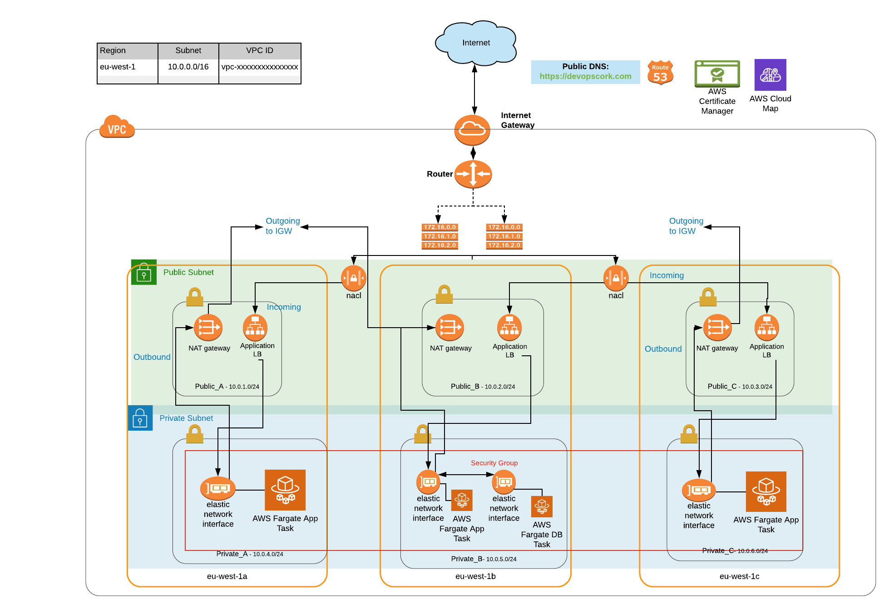

# terraform-aws-devops-playground
A "Hello World" Golang webapp with Docker deployed to AWS using Terraforms


## Status
[](https://travis-ci.com/bishy999/terraform-aws-devops-playground)

[](https://github.com/bishy999/terraform-aws-devops-playground/releases/latest)
[](https://github.com/bishy999/terraform-aws-devops-playground)
[](https://github.com/bishy999/terraform-aws-devops-playground)


## Pre-Requisites
   * [Terraform](https://www.terraform.io/) - Install
   * [AWS access](https://console.aws.amazon.com/) - With admin priviliges and ensure your [AWS CLI](http://docs.aws.amazon.com/cli/latest/userguide/installing.html) is working
   * [AWS Key Pair](http://docs.aws.amazon.com/AWSEC2/latest/UserGuide/ec2-key-pairs.html) - Create a key pair
   * Allow Terraform to use your `AWS` credentials in `~/.aws/credentials`
   * [Route 53](https://docs.aws.amazon.com/Route53/latest/DeveloperGuide/registrar.html)  - Register a new domain
   * [Certificate Manager](https://aws.amazon.com/certificate-manager/) - Create a cert for your domain


## Version Requirements
| Name | Version |
|------|---------|
| terraform | ~> 0.14.6 |
| aws | ~> 3.28.0 |


### Overview of golang-hello-world-webapp-ec2


### Overview of golang-hello-world-webapp-fargate


### Overview of golang-crud-webapp-fargate



## How to create
### Example golang-hello-world-webapp-ec2
```terraform

git clone https://github.com/bishy999/terraform-aws-devops-playground .
cd examples/golang-hello-world-webapp-ec2
Update specific values to your setup in main.tf
```

### Example golang-hello-world-webapp-fargate
```terraform

git clone https://github.com/bishy999/terraform-aws-devops-playground .
cd examples/golang-hello-world-webapp-fargate
Update specific values to your setup in main.tf
```

### Example golang-crud-webapp-fargate
```terraform

git clone https://github.com/bishy999/terraform-aws-devops-playground .
cd examples/golang-crud-webapp-fargate
Updat

### Initialize a new or existing Terraform working directory by creating initial files, loading any remote state, downloading modules, etc
```terraform
terraform init
```

### Preview of what it’s  going to create
```terraform
terraform plan
```


### Create stack
```terraform
terraform apply 

or

terraform apply -auto-approve
```


### check app is working via browser/cli
 
```
https://{domain_name}
curl https://{{domain_name}}
```

### Reads an output variable from a Terraform state file and prints the value
```terraform
terraform output 
```

### Delete stack
```terraform
terraform destroy
```
